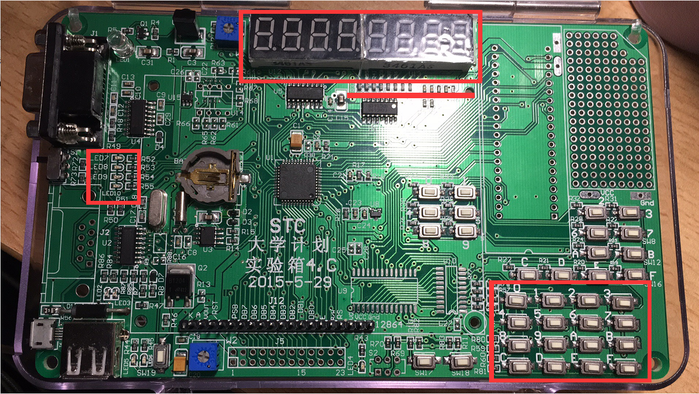

# README

## 功能概述

1. 时间

   - 实时更新当前时间
   - 增加或减少“时”的数值
   - 增加或减少“分”的数值

2. 日期

   - 实时更新当前日期
   - 增加或减少“月”的数值
   - 增加或减少“日”的数值

3. 温度

   - 对当前环境温度进行检测

4. 密码（4位）

   - 输入正确密码开门
   - 输入旧密码与新密码进行修改
   - 输入过程支持撤销
   - 连续输入5次错误密码时门锁锁死

5. 系统

   - 开门时提醒密码输入正确
   - 密码输入错误时报警
   - 长时间未关门时报警
   - 密码不可修改为0000
   - 日期及年份修改时，单独变量的改变将引起其他变量的更改

   

## 元件介绍



1. LED灯
   - 第一个LED亮时表示密码输入错误
   - 第二个LED灯亮时表示门超时未关
   - 第三个LED灯亮时指示修改密码时错误使用了0000
   - 四个LED灯运行跑马灯是表示门锁因非法操作锁死
2. 数码管：分别可以显示时间、日期、温度、密码的输入内容
3. 按键
   - 0号按键（17）：密码模式下表示输入0，日期模式下表示增加月份，时间模式下表示增加小时数
   - 1号按键（18）：密码模式下表示输入1，日期模式下表示减少月份，时间模式下表示减少小时数
   - 2号按键（19）：密码模式下表示输入2，日期模式下表示增加天数，时间模式下表示增加分钟数
   - 3号按键（20）：密码模式下表示输入3，日期模式下表示减少天数，时间模式下表示减少分钟数
   - 4-9号按键（21-26）：密码模式下分别表示输入4-9
   - A号按键（27）：切换为时间模式
   - B号按键（28）：切换为日期模式
   - C号按键（29）：切换为温度模式
   - D号按键（30）：切换为密码解锁模式、确定解锁
   - E号按键（31）：切换为修改密码模式、确定修改
   - F号按键（32）：撤销输入、初始化密码键入同时回到时间模式、关门操作

## 操作流程

1. 时间模式
   - 开机启动时间模式，显示当前的实时时间，格式为小时-分钟-秒钟
   - 点击按键0增加小时数
   - 点击按键1减少小时数
   - 点击按键2增加分钟数
   - 点击按键3减少分钟数
   - 点击按键B切换至日期模式（也可切换至其他模式）
2. 日期模式
   - 日期模式显示当前的日期，格式为年份月份天数
   - 点击按键0增加月份数
   - 点击按键1减少月份数
   - 点击按键2增加天数
   - 点击按键3减少天数
   - 点击按键C切换至温度模式（也可切换至其他模式）
3. 温度模式
   - 温度模式在右侧数码管上显示当前的实时温度（℃）
   - 点击按键D切换至解锁模式（也可切换至其他模式）
4. 解锁模式
   - 解锁模式初始时，右侧数码管显示4位-表示待输入，4位密码初始化为1234
   - 点击按键0-9进行逐一的输入
   - 当存在输入时，点击按键F进行错误输入的撤销
   - 当没有输入时，点击按键F回到时间模式
   - 当输入完成后，点击按键D进行密码确认
   - 密码正确时，四个LED灯全部亮起，表示正确，并在3秒后暗下，密码清空；错误时，只有第一个LED亮起
   - 密码正确时，相当于门锁已经开启，此时应该及时按下F键关门，如果超时不关门，则第二个LED会亮起，表示应当关门，此时按下F键关门，LED会暗下
   - 当连续输入5次错误密码时，门锁锁死，四个LED灯运行跑马灯示警
5. 修改密码模式
   - 修改模式初始时，左右数码管显示8位-表示待输入，左侧4位为输入原始密码区域，右侧4位为更新密码区域
   - 点击按键0-9进行逐一的输入
   - 当存在输入时，点击按键F进行错误输入的撤销
   - 当没有输入时，点击按键F回到时间模式
   - 当输入完成后，点击按键F进行修改确认
   - 密码正确时，四个LED灯全部亮起，表示正确，并在3秒后暗下，密码清空；错误时，只有第一个LED亮起
   - 当重置的密码为0000时，门锁提示此为错误操作，亮起第三个LED等
   - 当连续输入5次错误密码时，门锁锁死，四个LED灯运行跑马灯示警

## 实现过程

**【时间模式】**

首先实现简单的时间模式，使用second、minute、second三个变量存储时间信息，用RTC的读取操作实现时间信息的获取

	void	ReadRTC(void)
	{
		u8	tmp[3];
	ReadNbyte(2, tmp, 3);
	second = ((tmp[0] >> 4) & 0x07) * 10 + (tmp[0] & 0x0f);
	minute = ((tmp[1] >> 4) & 0x07) * 10 + (tmp[1] & 0x0f);
	hour   = ((tmp[2] >> 4) & 0x03) * 10 + (tmp[2] & 0x0f);
	}
为了实现时分加减的功能，通过使用键码的扫描得到按键信息，当按键为设置的4号键位时，进行时间的更改

此时应该注意，进行时间更改时，光是更改second  minute 和 hour的数值是不够的，要在更改之后调用writeRTC函数，这样才能进行有效的更改，否则再次使用readRTC函数获取数据时，仍然是没有被修改过的数据

```
void	WriteRTC(void){
	u8	tmp[3];
	tmp[0] = ((second / 10) << 4) + (second % 10);
	tmp[1] = ((minute / 10) << 4) + (minute % 10);
	tmp[2] = ((hour / 10) << 4) + (hour % 10);
	WriteNbyte(2, tmp, 3);
}
```

此时我们需要注意，由于日期模式的设计，在更改时间时，要影响到日期的数值，而单一RTC的循环是无法改变自定义数据日期的，所以我们在时间重置为00:00:00时调用一个自编辑的changeDate函数来进行日期的更改（实际上调用后续的changing函数即可）

```
void	changeDate(void){
	if(hour == 0 && minute == 0 && second == 0){
		if(day == 31 && month == 12){
			day = 1;
			month = 1;
			year++;
		}
		else if(day == day_num[month-1]){
			month++;
			day = 1;
		}
		else{
			day++;
		}
	}
}
```

由此我们完成了简单的时间模式编写，但是由于日期模式和时间模式的操作近似且有联系，所以我们应将时间模式和日期模式放在一起操作，具体过程见下方日期模式板块

**【日期模式】**

由于日期模式和时间模式较为相似，且变量之间有联系，在实现简单的时间模式之后，可以用相同的方法进行日期模式的设置，由于两个模式涉及不同的变量的改变，所以我们用一个变量curr_show来记录当前的模式。

也就是说，当点击按键A时，curr_show值设置为0表示时间模式，当点击按键B时，curr_show更改为1表示当前为日期模式。这样在调整时分和月日的时候就可以根据curr_show的数值来决定究竟应该改变哪些变量。

	if(KeyCode == 27)	curr_show = 0; // 时钟模式
	if(KeyCode == 28)	curr_show = 1; // 日期模式
此时，当模式为日期或时间时，点击17-20键码的按键时，就会调用我事先写好的changing函数，进行日期和时间的连锁修改

	else if(KeyCode >= 17 && KeyCode <= 20 && curr_show != 3){	// 时间和日期的调整
				changing(KeyCode,curr_show);
	}
之所以编写changing函数是因为总会出现不纯粹的加减情况，比如加一分钟时，小时数要+1，减一小时时，天数要-1的情况，如果日期和时间分开判断，那么是很繁琐的操作过程，所以我们编写统一的changing函数，通过传入的键码和模式两个操作判断应该对什么变零进行什么样的操作。

编写代码还有一个可以化简的地方就是我们可以在changing函数里循环调用changing函数，以达到减轻代码负担的目的，如，在传入20（keycode），0（curr_show）时，表示需要将minute数-1，但是当minute为0时，我们需要对hour-1，而hour又会存在为0的情况，又要进行一轮判断，所以，我们在minute为0时再次调用changing函数并且传入18和0表示要对hour进行-1的操作，省去了冗余的判断步骤(代码过长，只贴出一部分)

```
void	changing(u8 KeyCode, u8 curr_show){
	if(curr_show == 0){
		if(KeyCode == 17){
			if(hour == 23){
				hour = 0;
				changing(19, 1);
			}
			else   hour++;
		}
		...
	}
}
```

**【温度模式】**

当按下C键时，切换为温度模式，此时修改curr_show为2，此时调用NTC程序使得数码管上显示当前的温度大小（完整代码暂不附上）

```
if(KeyCode == 29)	curr_show = 2; // 温度模式
```

此时我们会发现，当模式很多时，数码管的显示如果在一个函数中进行判断和选取是十分麻烦的，所以我们可以编写这样一个Display函数进行显示的分发，向其中传入curr_show信息告知当前的模式，然后再根据模式进行不同显示方式的调用，这样，当我们后续需要增加模式显示时，也只需要编写该模式下的显示函数，然后在display函数中调用即可（具体的显示函数包括后续模式的函数均统一存放在display.c文件中，不在此处附上）

```
void Display(u8 curr_show){	
	if(curr_show == 3){
		DisplayKey();
	}
	else if(curr_show == 4){
		DisplayNewKey();
	}
	else{
		reKey();
		if(curr_show == 0){
			DisplayTime();
		}
		else if(curr_show == 1){
			DisplayDate();
		}
		else if(curr_show == 2){
			DisplayTemp();
		}
	}

```

要注意，如果使用例程的话，会出现单片机爆内存的问题，研究后我们可以发现，预设的温度检查范围为-40到120度，这个范围是很大的，也不适合实际应用，所以，我们将temp_table部分进行修改，缩减为-15度到50度，这样基本上可以涵盖我们使用的范围，同时，由于对温度表进行了修改，0度的指针也从40变为了15，在主函数的温度调整部分，我们要把扩大十倍的400改为150，这样才可以进行准确的测温

```
j =	get_temperature(j);	//计算温度值
if(j >= 150)	F0 = 0,	j -= 150;		//温度 >= 0度
else			F0 = 1,	j  = 150 - j;	//温度 <  0度
```

**【输入密码模式】**

此模式下，curr_show数值为3，初始化时要使用DisplayKey函数将数码管左侧4位暗下，右侧4位设置为-表示待输入，而为了存放输入密码、标准密码，我们设置standard[]和key[]两个变量，将standard初始化为1,2,3,4，key初始化为0,0,0,0（这也是为什么不可以将新密码设为0000的原因）

此时，光有key和standard是不够的，我们还需要判断当前输入到了哪个位置，于是，我们使用curr_input进行记录，每输入一个数字，便将key的位置进行相应的修改，同时把curr_input++，表示当前输入的移动

为了进行合理的实时显示，我们开始的初始化显示函数需要判断curr_input的数值，curr_input位置之前的内容表示已经有了输入，此时，数码管应该显示输入的内容也就是key内存储的数据，curr_input位置之后的内容表示还没有进行输入，也就是要显示-，由此我们可以编写如下的显示函数，从而完成了输入密码的实时显示

```
for(i = 4; i < curr_input + 4; ++i) LED8[i] = key[i-4];
for(i = curr_input + 4; i < 8; ++i) LED8[i] = DIS_;
```

显示已经做完，我们需要实现再次点击D键确认密码的功能，这时需要注意，确认密码和进入输入密码模式都是D键触发，而两种状态不同点在于点击时curr_show的数值不一样，所以当curr_show为3时证明此时D的操作为确认密码，否则我切换模式（后续修改密码也相同，不做赘述），同时，也要注意，只有当用户输入的密码满足4位时，才可进行密码判断的操作

```
if(KeyCode == 30 && curr_show == 3 && curr_input == 4 && able == 1){   // 输入密码模式，检测
	if(standard[0] == key[0] && standard[1] == key[1]  && standard[2] == key[2] && standard[3] == key[3]){
		P17 = 0;
		P16 = 0;
		P47 = 0;
		P46 = 0;
		open = 1;
		try = 0;
	}
	else{
		alert(1);
		if(++try >= 5){
			alert(4);
		    able = 0;
		}
		curr_input = 0;
	}
}
```

在确认密码函数中，我们便可以实现一系列的示警表达。

- 当输入密码正确时，四盏灯亮起，同时此时门应该是开启的，所以我们引入open变量，1表示开启，0表示关闭，初始化open为0关闭，当输入密码正确后，就将open调整为1表示此时门是开着的

- 此时我们需要处理的情况就是门超时未关，这个逻辑很简单，就是引入一个opentime变量表示当前门开的时间，当open为1时，逐渐累积opentime的大小，而一旦open为0，就把opentime也清零；当opentime达到2秒时，为了保证隐私，需要将当前的密码输入清空，当opentime达到9秒时，即判定为超时，调用alert函数并传入情况2，进行第二盏灯的报警

  ```
  if(open == 1) opentime++;
  else opentime = 0;
  if(opentime >= 2000) reKey();
  if(opentime >= 9000) alert(2);
  ```

- 而当密码输入错误时，我们也要进行相应的报警，即让第一盏灯亮起，这时我们也要考虑，报警的情形不只是输入密码错误这一种，所以我们索性设置一个alert函数，通过传入的数值表示不同的示警情况，然后根据这个情况进行相应的响应（代码不附上，在main.c中）

- 此时我们留下的功能只有一个多次输入错误密码锁死门锁的功能，这个功能实现的逻辑也很简单，就是引入一个try变量，表示连续尝试的数目，初始化为0，引入一个able变量，1表示可用，0表示不可用，初始化为1。当输入错误密码时，try的数值就会+1，只有输入正确密码后或者等待一定的时间后，才可以重新尝试，也就是try的数值才会归零，而实现这个等待时间需要引入trytime变量；当try的数值已经为5时，门锁锁死，嗲用alert传入4进行跑马灯报警

  ```
  if(try > 0 && try < 5) trytime++;
  if(trytime >= 20000){
  	try = 0;
  	trytime = 0;
  }
  ```

**【修改密码模式】**

此模式下，curr_show数值为4，表示应该修改，初始化数码管的函数和解锁模式相同，不过要将左侧4位也设置为-，表示待输入原始密码，右侧4位仍旧待输入，不过为新密码。

这时我们发现，和解锁模式不同，修改模式要输入8位的数据，而这时如果我们引入一个新的数组显然是不划算的，所以我们将key扩充为8位，初始化为8个0而非4个0，并在curr_show模式下将curr_input上限设置为8，然后再进行相应的操作即可。

由于修改模式和解锁模式的示警和输入都十分近似，所以这里不做赘述，修改成功时也只需要将standard改为输入的内容同时重置即可；但是有一处不同点在于，在最后做密码检测时，原始密码输入错误固然是一个方面，但是更重要的是不能把新密码设置为0000，这样在归零key的时候会一直判断为解锁，所以，当用户将新密码输入为0000时，修改不成功，同时还要调用alert函数传入3进行报警，报警形式为亮起第3盏灯

```
if(KeyCode == 31 && curr_show == 4 && curr_input == 8 && able == 1){   // 修改密码模式，检测
   	if(standard[0] == key[0] && standard[1] == key[1]  && standard[2] == key[2] && standard[3] == key[3]){
		try = 0;
		reKey();
		if(key[4] == 0 && key[5] == 0 && key[6] == 0 && key[7] == 0){
			alert(3);
		}
		else{
			P17 = 0; P16 = 0;P47 = 0;P46 = 0;
			standard[0] = key[4]; 
			standard[1] = key[5]; 
			standard[2] = key[6]; 
			standard[3] = key[7];
			delay_ms(1500);							 
			curr_show = 3;	 
		}	
	}
	else{
		alert(1);
		if(++try >= 5){
			alert(4);
			able = 0;
		}
		curr_input = 0;
	}
}
```

**【F键操作】**

由于F键更偏向系统功能，所以我们单独拿出来讲。

首先，F键有4个作用，分别撤销两个模式下的输入、关门操作和门锁复位，对此，我们只需要进行模式的判断并进行操作即可。

	if(KeyCode == 32){	  // 撤销+关门+门锁复位			
		if(curr_show == 3 && curr_input > 0 && able == 1){
			key[curr_input-1] = 0;
			LED8[curr_input+3] = DIS_;
			curr_input--;
		}
		else if(curr_show == 4 && curr_input > 0 && able == 1) {
			key[curr_input-1] = 0;
			LED8[curr_input-1] = DIS_;
			curr_input--;
		}
		else{
			open = 0;
			reKey();
			curr_show = 0;
		}
	}  
当模式为3和4且当前有输入时，F键的功能应该为撤销，此时回退curr_inpu数值，将key的最后一位输入值归零，并把当前输入的显示重置为-即可

当模式不是3或者4，或者并没有输入数据时，我们把关门和门锁复位一同实现，将open归零，暗下4盏灯，同时将输入的key全部清空，并设置curr_show为0重置为时间模式

**综上，我们完成了本次项目硬件方面的所有功能实现**